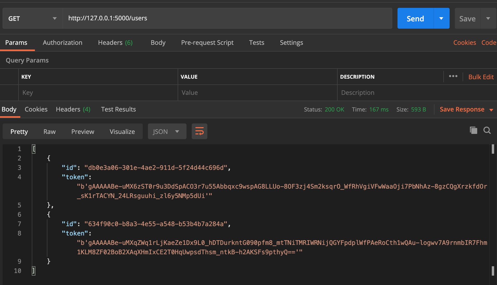

# Example with Cryptography library

## Configuring the environment


If you don't have pipenv in MAC:
````shell script
brew install pipenv
````

To create the environment and install the dependencies.

```sh
pipenv install --python 3.7
pipenv shell
pipenv install
```

To deactivate the environment:

```sh
exit 
```

## Run the program

To run the program:

```sh
pipenv shell
pipenv run start --port $YOUR_PORT
```

* **port**: is set by default to 5000.

## Test the API

Once the application is up and running you can request for `http://127.0.0.1:5010/users`.
Here is an example from postman:



You can use curl:

```shell script
curl http://127.0.0.1:5000/users/
```

The output:

````json
[
    {
        "id": "fc15db10-71f5-41e1-b15b-b1d24fc44eb8",
        "token": "b'gAAAAABe-uVZZ3B6y12Hukv_tYge0GR5WD3yRVlqOnBy0wDryqCBTkZorlCKg5nDIzQ5i2yFtVHS315w83vYWlL36ybEHBJOY4VGuq_UdQ-Rfq4mhVbSd9XOtrkfZW58gLbLYmKXsPiW'"
    },
    {
        "id": "2430a467-de56-4d2f-8d5f-06ee67ac41eb",
        "token": "b'gAAAAABe-uVZbaZHScL6wD2eykH3ROep316ep2u5mrl_NAH_SaCEPnrJEXeqTPx6_KIZw1Z6qpsBD3g_7qu0ZR2VNsbV9KCUC8KZVWtjXyIkKk3baqRrq62ifu8Px1ZUv8pkw_Z2Nw1wnqT74zEnydrC3alCkNLEvw=='"
    }
]
````
